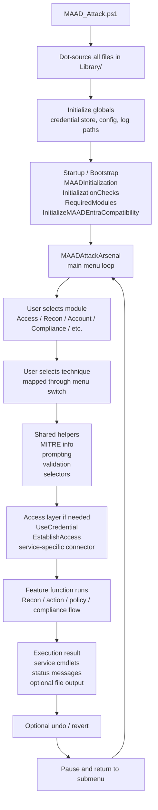

# Execution Flow

This page describes the high-level runtime flow of MAAD-AF from launch to feature execution.

## High-Level Flow

## Step-by-Step

### 1. Entrypoint

The tool starts in [MAAD_Attack.ps1](../MAAD_Attack.ps1).

That script:

- unblocks local library files
- dot-sources every `.ps1` file in `Library/`
- initializes a few global file paths
- runs startup/bootstrap checks
- launches the main interactive menu

## 2. Bootstrap

The main startup work is split across:

- [MAAD_Initialization.ps1](../Library/MAAD_Initialization.ps1)
- [MAAD_Basic_Modules.ps1](../Library/MAAD_Basic_Modules.ps1)

The bootstrap phase handles:

- basic local directory setup
- output and config file creation
- session limit tuning for Windows PowerShell 5.1
- dependency discovery and installation
- Entra compatibility bootstrap

## 3. Main Menu

The main user experience lives in [MAAD_Attack_Arsenal.ps1](../Library/MAAD_Attack_Arsenal.ps1).

This file defines:

- the top-level menu categories
- the numbered options inside each category
- the `switch` statement that maps menu choices to functions

Conceptually, this file is the tool's command router.

## 4. Shared Prompt and Selector Layer

Most features do not prompt or validate input directly. Instead they call shared helpers from [MAAD_Basic_Modules.ps1](../Library/MAAD_Basic_Modules.ps1), such as:

- `EnterAccount`
- `EnterGroup`
- `EnterRole`
- `EnterMailbox`
- `EnterSharepointSite`

These helpers both validate input and populate shared global variables that later feature functions consume.

## 5. Access Layer

If a feature requires service connectivity, it usually relies on:

- [MAAD_Credential_Store_Manager.ps1](../Library/MAAD_Credential_Store_Manager.ps1)
- [Access_Modules.ps1](../Library/Access_Modules.ps1)

The flow is usually:

1. choose or prompt for credentials or token
2. establish a service-specific session
3. run the feature against that session

## 6. Feature Execution

Feature functions are grouped mostly by domain:

- [ReconModules.ps1](../Library/ReconModules.ps1)
- [Compliance_Modules.ps1](../Library/Compliance_Modules.ps1)
- [SharepointModules.ps1](../Library/SharepointModules.ps1)
- small focused files like [ResetPassword.ps1](../Library/ResetPassword.ps1) and [DisableMFA.ps1](../Library/DisableMFA.ps1)

Most actions follow this rough pattern:

1. show MITRE context
2. prompt for target
3. validate target or enumerate options
4. execute the service cmdlet
5. display output and optionally save artifacts
6. offer an undo or cleanup path when possible

## 7. Output and Undo

The output layer is mostly handled by:

- `MAADWriteProcess`
- `MAADWriteSuccess`
- `MAADWriteInfo`
- `MAADWriteError`
- `Show-MAADOutput`

Many attack actions also offer a best-effort revert step after success.

## 8. Return to Menu

After execution, most features call `MAADPause` and return to the submenu loop in [MAAD_Attack_Arsenal.ps1](../Library/MAAD_Attack_Arsenal.ps1).

## Important Structural Note

The tool is heavily stateful. Intermediate values and session context are often passed through `$global:*` variables rather than returned explicitly between functions. That is a core reason the execution flow is simple to follow at runtime but harder to maintain safely.
